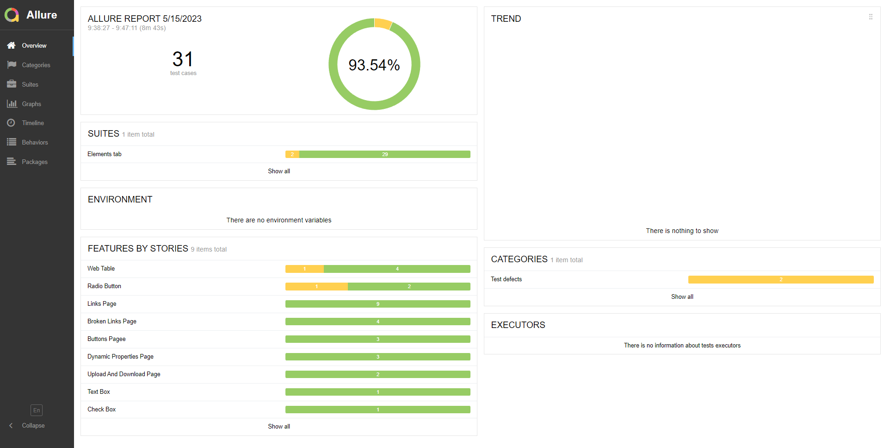
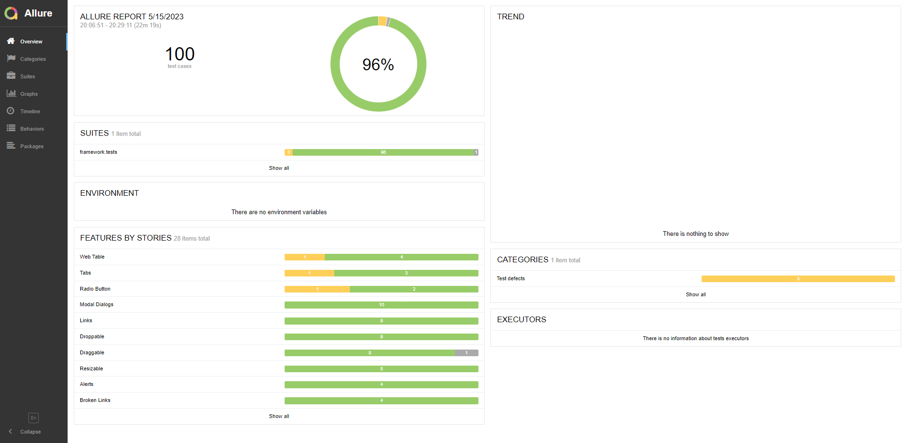
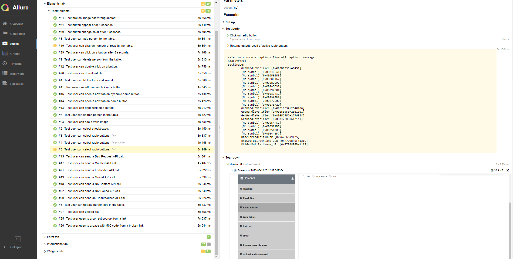

# testing_framework_selenium_pytest

## Used tools

+ [Python 3.11.3](https://www.python.org/downloads/)
+ [Selenium](https://selenium-python.readthedocs.io/) - API for SeleniumWebDriver
+ [pytest](https://docs.pytest.org/en/7.3.x/) - test runner
+ [webdriver_manager](https://github.com/SergeyPirogov/webdriver_manager) - for webdrivers (no more driver installations
  needed)
+ [Faker](https://faker.readthedocs.io/en/master/) - for test data generation
+ [Allure](https://github.com/allure-framework/allure2) - for test run reports

## Allure usage example

**Add allure to PATH environment if using Windows.**

To get Allure reports you should run tests with the following flag

```shell
--alluredir=
```

Example:

```shell
pytest --alluredir=elements_report elements_test.py
```

Where:

+ `elements_report` - is a dir with reports files
+ `elements_test` - is a test files for elements page.

To get Allure report from test results use the following command

```shell
allure serve allure_results
```



To run specific test you can use the following command

```shell
pytest --alluredir=elements_report .\framework\tests\elements_test.py::TestElements::TestTextBox::test_text_box
```

To run all tests with Allure report:

```shell
pytest --alluredir=allure_results .\framework\tests
```

You can check my last run of all tests from my framework:

```shell
allure serve allure_results
```

## Framework all tests run



### One of found defects with a screenshot


